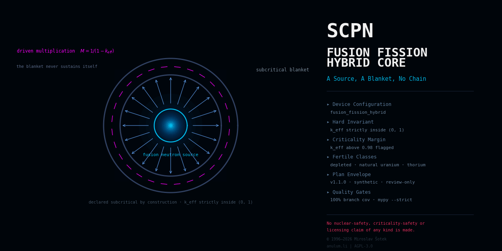

<!--
SPDX-License-Identifier: AGPL-3.0-or-later
Commercial license available
© Concepts 1996–2026 Miroslav Šotek. All rights reserved.
© Code 2020–2026 Miroslav Šotek. All rights reserved.
ORCID: 0009-0009-3560-0851
Contact: www.anulum.li | protoscience@anulum.li
SCPN Fusion Fission Hybrid Core — README
-->

<div align="center">
  
</div>

# SCPN Fusion Fission Hybrid Core

Governed device-family repository for fusion–fission hybrid systems within
the SCPN Reactor Systems Research Group. This repository is the designated
owner of device-level truth for the `fusion_fission_hybrid` configuration
of the SCPN Phase Orchestrator reactor registry (fusion source with
subcritical blanket).

**Evidence maturity: `computational_prototype`** (per-capability; ADR 0002).
Five capabilities are implemented: the device configuration model —
validated parameter objects with documented consistency estimates,
canonical serialisation, and a data-only SPO registry pin
(evidence: `VALIDATION.md#device-configuration-model`); the
diagnostic and clock semantics model — synthetic channel and clock
declarations aligned fail-closed with the pinned SPO observability
catalogue (ADR 0003, evidence:
`VALIDATION.md#diagnostic-and-clock-semantics`); and level-0 device
physics — the published closed-form figures of merit of a hybrid, the
thermal power it produces for the fusion power it consumes and the
fission reactors the bred fuel supports, evaluated on a declared
blanket, driver and fission-reactor pairing and anchored on values a
filed source prints (ADR 0005, evidence:
`VALIDATION.md#level-0-device-physics`); and the two geometry tiers —
the tessellated and B-rep models of the radial build, whose zone
thicknesses are declared so that every outer radius the filed source
prints is recovered rather than restated (ADR 0006, evidence:
`VALIDATION.md#device-3d-model` and `VALIDATION.md#device-cad-model`).
No parameter set or
channel describes any real machine or diagnostic; the claim inventory
is empty and verified by the domain validator.

## Scope

This repository owns, for the fusion–fission hybrid family:

- the device boundary: plant and experiment truth, lifecycle, and
  configuration policy for the **coupling** of a fusion neutron source to
  a subcritical fission blanket — source-to-blanket neutronics coupling
  declarations, blanket multiplication accounting (effective
  multiplication strictly below unity as a declared boundary),
  energy-multiplication and fuel-conversion bookkeeping contracts, and
  source-class declarations that reference the designated source device
  core without absorbing it;
- diagnostic semantics, reference frames, and clock identity declarations
  for the coupled system (source-rate channels, blanket flux and
  multiplication monitors);
- actuator-response model boundaries and the declared safety envelope;
- the device-owned CONTROL adapter specification;
- the binding to the SCPN Phase Orchestrator reactor registry
  (version `1.0.0`, digest
  `786d9542ce76c56dd7748fa948b17efed6c073525e527ce90e6d5e29a2d00090`);
- the machine-readable domain manifest `reactor-domain.json` and the derived
  Studio portfolio descriptor (integration state `not_federated`).

## Explicit exclusions

- **Fusion source device physics**: the designated source device core per
  configuration (tokamak, mirror, MIF, or other family) — this repository
  couples to a declared source; it never owns the source's physics.
- **Ordinary blanket and balance-of-plant utilities**: out-of-scope plant
  engineering; only the coupling contracts live here.
- **Solver mathematics and validation evidence**: `SCPN-FUSION-CORE` until
  an exact surface passes the reactor family migration gate; no solver code
  exists in, or was copied into, this repository.
- **Typed signal semantics and comparability**: `SCPN-PHASE-ORCHESTRATOR`
  (review-only output; never actuation).
- **Control admission and action formation**: `SCPN-CONTROL` is the sole
  software authority that forms an admitted `ControlAction`.
- **Machine protection and nuclear safety**: independent systems retain
  the final veto; subcriticality assurance is nuclear-safety territory
  that this repository only declares and never implements.
- **Portfolio presentation, identity, entitlement, and execution gating**:
  `SCPN-STUDIO`.

## Non-claims

This repository is not machine-ready, not safety-certified, and not
reactor-ready. It contains no implemented solver, no controller, no
benchmark result, no experimental correlation, no dataset, and no published
artefact, and no parameter set describes or validates any real machine.
It makes **no nuclear-safety, criticality-safety, or licensing claim of
any kind**. Source-class,
blanket-concept, and fuel-cycle choices are configuration facets, not
separate claims. No capability has reached any
evidence-maturity state beyond `computational_prototype`.

## Architecture

The five-surface boundary and the position of this repository in the SCPN
ecosystem are defined in [`docs/ARCHITECTURE.md`](docs/ARCHITECTURE.md) and
fixed by
[`docs/adr/0001-repository-boundary.md`](docs/adr/0001-repository-boundary.md).
The threat model is in [`docs/THREAT_MODEL.md`](docs/THREAT_MODEL.md); the
CONTROL adapter contract is in
[`docs/CONTROL_ADAPTER_SPECIFICATION.md`](docs/CONTROL_ADAPTER_SPECIFICATION.md).

## Validation

Every gate currently active in this repository is listed in
[`VALIDATION.md`](VALIDATION.md). The local sequence is:

```bash
make lint        # ruff check + ruff format --check
make typecheck   # mypy --strict tools tests
make test        # pytest with 100 % statement and branch coverage on tools/
make validate    # domain manifest, descriptor, and inventory checks
make preflight   # the full fail-closed gate sequence
```

## Security

See [`SECURITY.md`](SECURITY.md) for the supported states and the private
reporting route (protoscience@anulum.li).

## Licensing

AGPL-3.0-or-later for the public repository, with a commercial licence
available (see [`NOTICE.md`](NOTICE.md)). Licence texts are under
[`LICENSES/`](LICENSES/); machine-readable licensing metadata follows
REUSE 3.x (`REUSE.toml`).

## Citation

Citation metadata is provided in [`CITATION.cff`](CITATION.cff). No release,
version, or DOI exists yet; cite the repository state you inspected.
